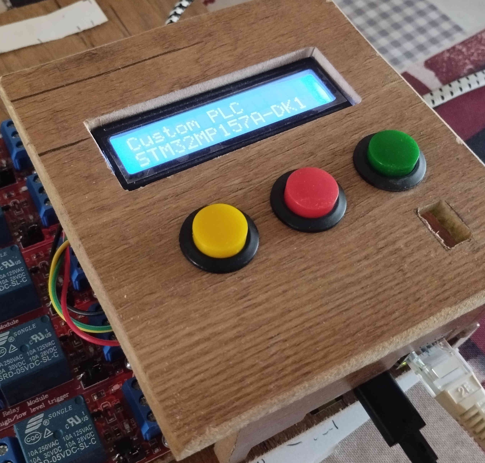
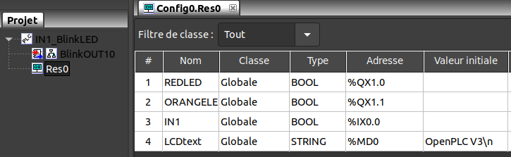
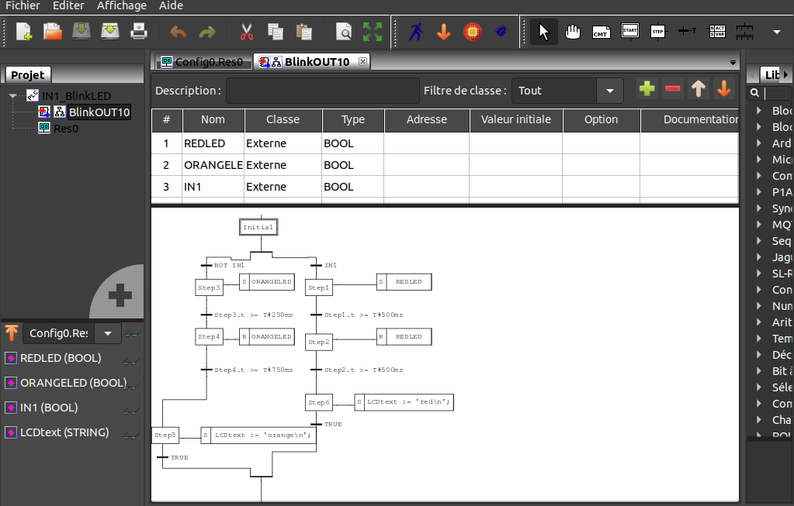
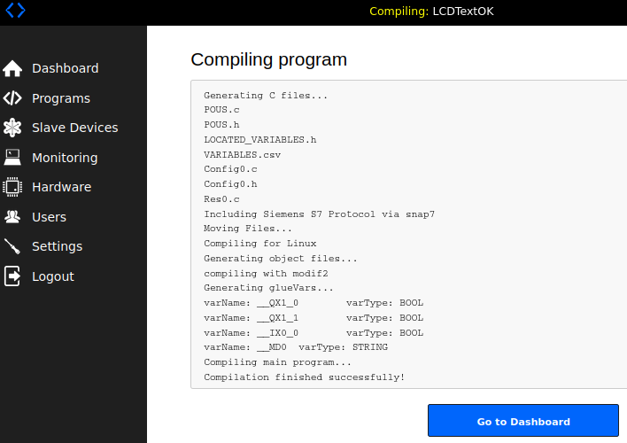
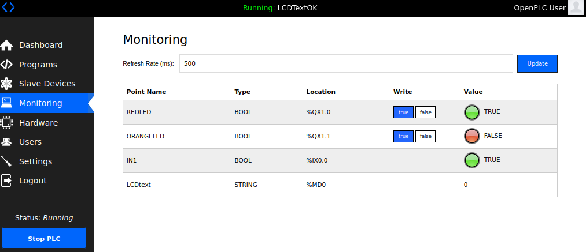

Turn your STM32MP1 into a PLC automate monitored by OpenPLC_v3.

Physical PLC view (ecologic):

  

# Installation of OpenPLC_v3 Editor on PC Linux
first install the version of OpenPLC_v3 Editor on your PC Linux. This will be used to : 

Edit your grafcet or ladder programs

  
  

Build the .st file

Transfert the code build/generated_plc.st to the target PLC STM32 Automate through the webserver application. There will be on the fly cpp-compilation on running target

  

Monitor on the Webserver application the running automation

  

# Installation of OpenPLC_v3 runtime on the target STM32

To install, you'll need several tools installed on STM32. Therefore you can use meta-custom/recipes-core/images/custom-image.bb

Some implementations of scripts need to be made to fully manage the installation as OpenPLC_v3 Runtime is not meant to match exactly STM32 configuration. I noticed that python .venv was not present in my installation of OpenPLC_v3. You can work around by using the installed environment anyway.

Anyway this installation needs to know what you are doing, at the risk of spending some time.

